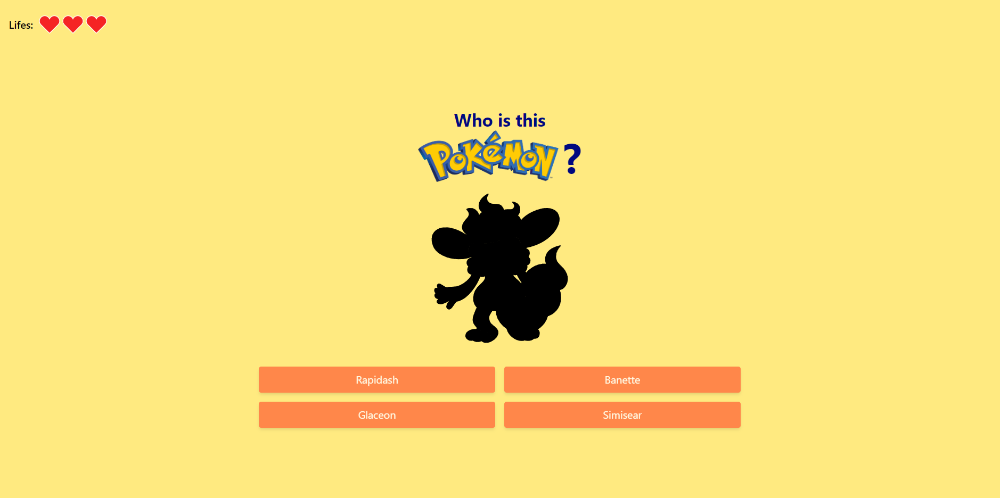
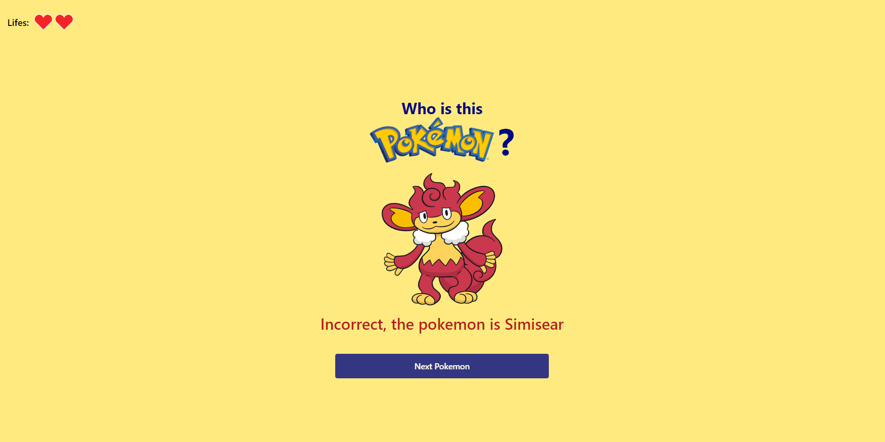
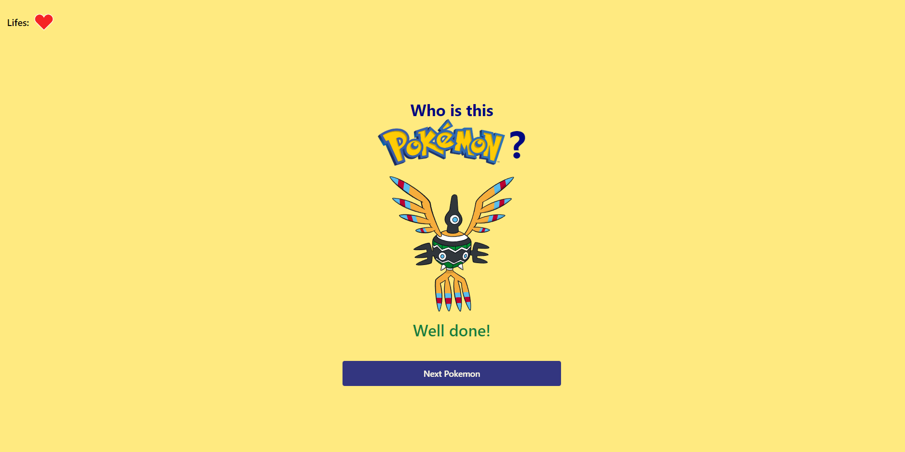
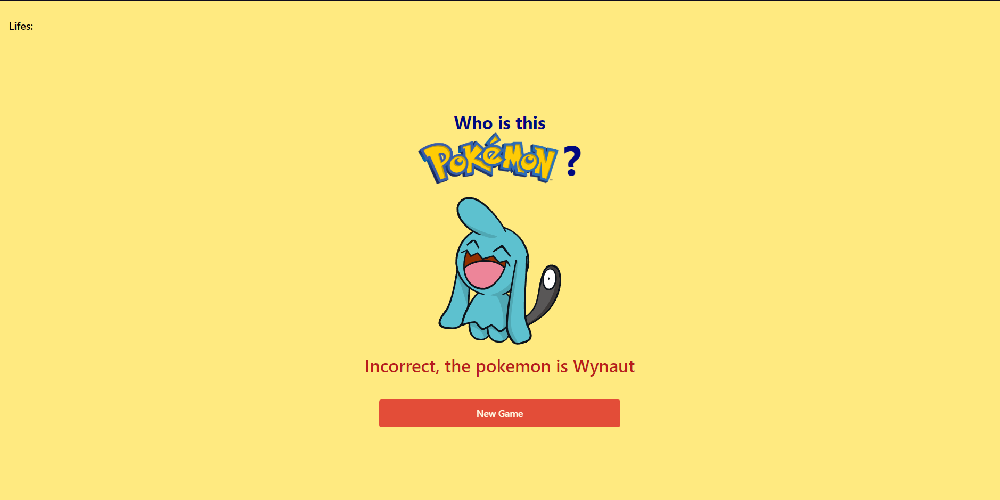

# Guess Pokemon
This application is a game to guess the pokemon.

### Functionality
- Keep the pokemon hidden until a option is selected
- Bring 4 aleatory pokemons from the pokeAPI
- The game gives the option to start over upon losing the 3 lifes

## Installation
To install this project follow the next steps:
1. Download the repository found here: [
GuessPokemon-Vue](https://github.com/SuaferoanTJK/GuessPokemon-Vue).
2. Run "**npm install**" script.
3. Run "**yarn serve**" script.
4. Go to http://localhost:8080
5. (Optional) If you want to run the test run "**yarn test:unit**" script.

## Screenshots

  
  
  
  

## Get in touch
### LinkedIn
https://www.linkedin.com/in/andrés-f-suárez/
